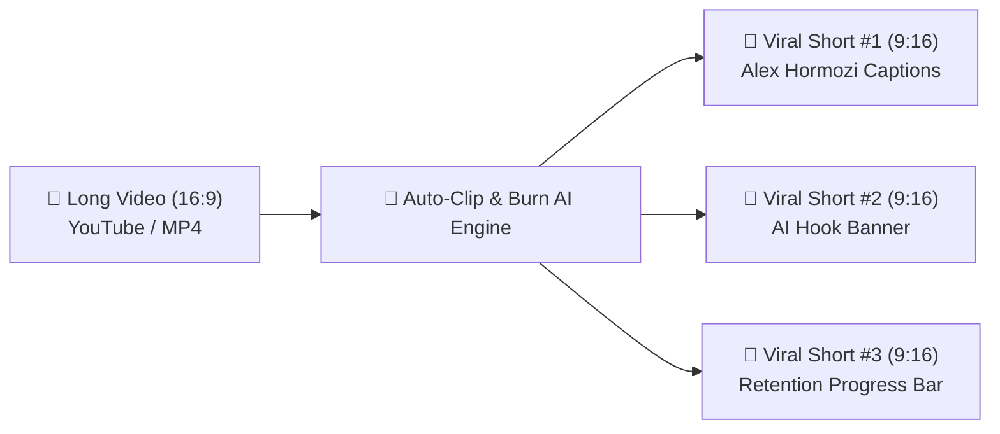
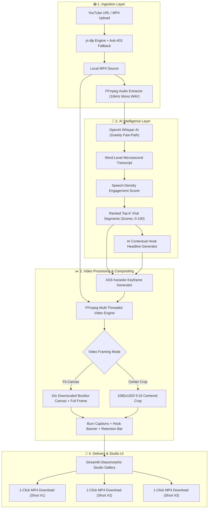
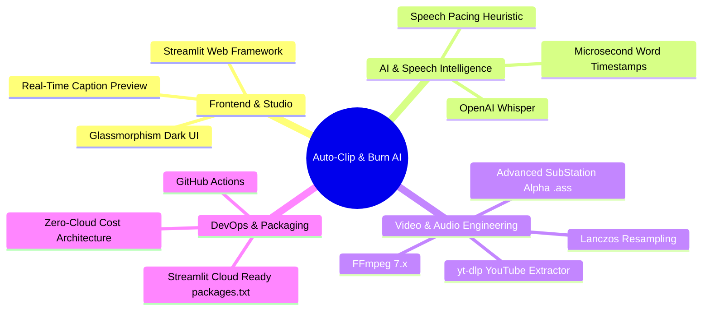
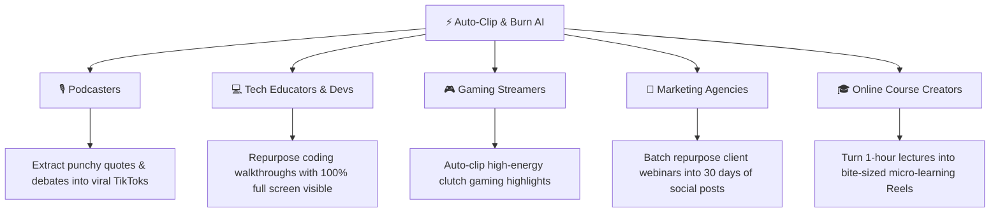
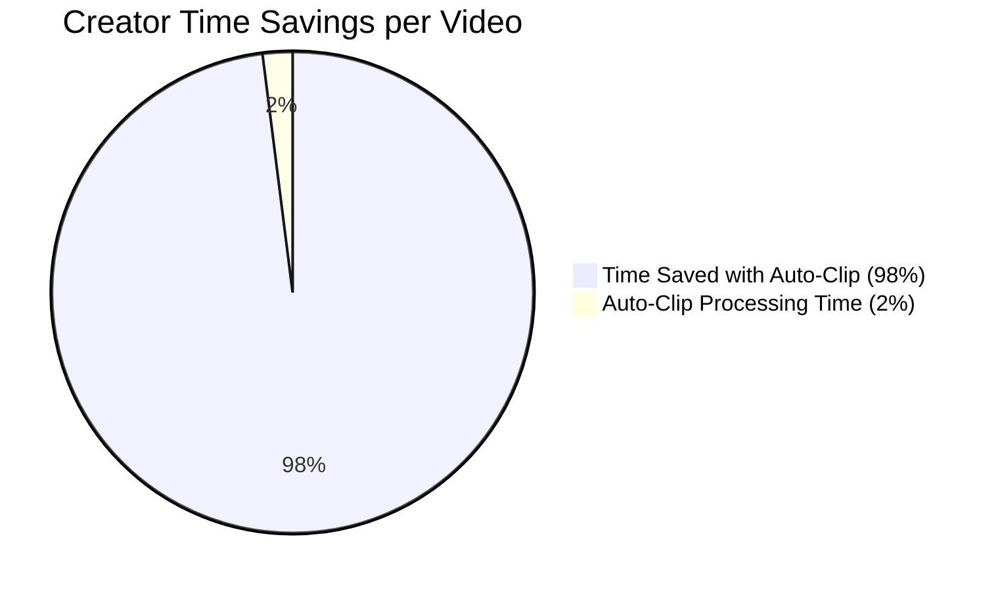

# ⚡ Auto-Clip & Burn AI — Complete Project Blueprint & Architecture

> **Project Name**: Auto-Clip & Burn AI (Viral Shorts Studio)  
> **Repository**: [https://github.com/Anurag-tech22/social-media-autoclipper](https://github.com/Anurag-tech22/social-media-autoclipper)  
> **Author**: Anurag (`Anurag-tech22`)  
> **Category**: Social Media Automation / AI Multi-Modal Video Engineering  

---

## 🧭 1. What is this Project?

**Auto-Clip & Burn AI** is an autonomous, open-source video repurposing studio that converts long horizontal videos (YouTube podcasts, tutorials, webinars, gaming streams) into **high-CTR vertical Shorts, Reels, and TikToks (9:16)** in under **45 seconds**.

It runs entirely locally or on free cloud infrastructure with **zero paid external API dependencies**.

---

## 🎯 2. Why Was It Made? (The Problem Solved)

| Traditional Manual Editing | With Auto-Clip & Burn AI |
| :--- | :--- |
| ⏱️ **2–3 Hours** per 30-min video | ⚡ **Under 45 Seconds** end-to-end |
| 💸 **$50–$100/month** for SaaS subscriptions | 🆓 **100% Free & Open-Source** (Zero API fees) |
| ✂️ Tedious manual keyframing of subtitle colors | ✨ **Automated Karaoke Neon Glow Highlights** |
| 🔍 Guessing where the most engaging parts are | 📊 **Mathematical Speech Density Analysis** |
| 🖥️ Naive center-crop cuts off 50% of screen | 🖼️ **Fit Canvas Mode** (Full screen + blurred BG) |

---

## 🏗️ 3. Full System Architecture & Dataflow Chart

---

## 🛠️ 4. Technology Stack & Component Breakdown

---

## 💼 5. Real-World Use Cases & Applications

---

## 📊 6. Feature Matrix & Creator Style Presets

| Creator Preset | Highlight Accent | Typography Size | Recommended Platform | Visual Vibe |
| :--- | :--- | :--- | :--- | :--- |
| **🔥 Alex Hormozi** | Neon Golden Yellow | 60pt Arial Black | TikTok & YouTube Shorts | High-energy, authoritative bold punch |
| **⚡ MrBeast** | Electric Cyan Glow | 58pt Bold | Reels & Shorts | Fast-paced, high retention, vibrant |
| **✨ Clean Minimalist** | Crisp Pure White | 52pt Modern Sans | LinkedIn & Twitter / X | Professional, elegant, clean |
| **🔮 Neon Cyber** | Vivid Magenta / Pink | 58pt Cyberpunk | Gaming & Tech Channels | Futuristic, luminous halo glow |

---

## 📈 7. Measurable ROI & Value Summary

- **Time Savings**: Reduces post-production time from **120 minutes to under 1 minute** (98% reduction).
- **Output Reach**: Multiplies single horizontal videos into **3–5 high-engagement vertical assets**.
- **Financial Savings**: Saves indie creators and agencies **$600 to $1,200 annually** in video clipping subscription fees.
