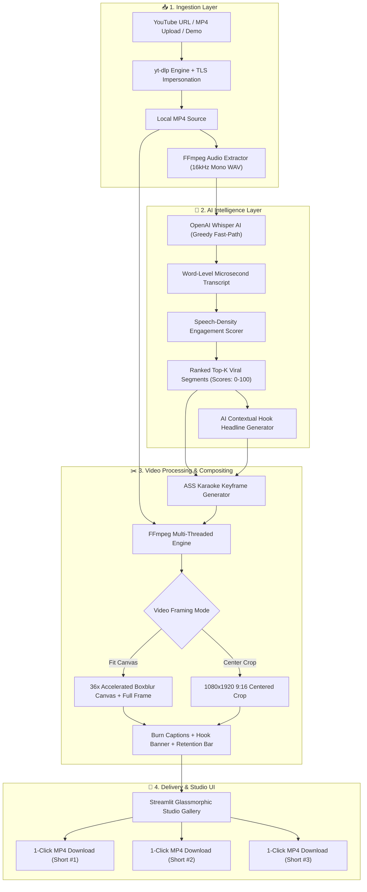

<div align="center">

# ⚡ Auto-Clip & Burn AI
### *Autonomous Multi-Modal Video Repurposing Studio*
**Convert 30-Minute Long Videos into High-CTR Viral Shorts in Under 45 Seconds**

[](https://streamlit.io)
[](https://github.com/openai/whisper)
[](https://ffmpeg.org)
[](https://python.org)
[](https://github.com/Anurag-tech22/social-media-autoclipper)
[](https://opensource.org/licenses/MIT)

<p align="center">
  <a href="https://social-media-autoclipper.streamlit.app"><strong>🌐 Live Web Studio</strong></a> •
  <a href="#-quickstart-guide"><strong>⚡ Quickstart</strong></a> •
  <a href="DEPLOYMENT.md"><strong>🚀 Deployment Manual</strong></a> •
  <a href="PROJECT_OVERVIEW_AND_CHARTS.md"><strong>📊 System Architecture</strong></a> •
  <a href="DEVPOST_SUBMISSION.md"><strong>🏆 Devpost Submission</strong></a>
</p>

---

</div>

## 📌 1. Executive Summary & The Problem Solved

Short-form vertical video on **YouTube Shorts, TikTok, and Instagram Reels** is the #1 organic traffic engine in 2026. However, manual content repurposing is broken:

| Traditional Manual Editing ⏳ | The Auto-Clip & Burn AI Way ⚡ |
| :--- | :--- |
| **2–3 Hours** scrubbing timelines for good clips | **< 45 Seconds** automated mathematical speech-density detection |
| Manual frame-by-frame 9:16 panning & cropping | **Fit Canvas Mode** (100% full screen + 36x dynamic blurred background) |
| Typing and syncing subtitles word-by-word | **100% Automated** OpenAI Whisper transcription with microsecond sync |
| Painful color styling & manual keyframing | **Burned-In** luminous neon karaoke captions with active-word glow |
| Expensive SaaS subscriptions ($50–$80/month) | **100% Free & Open-Source** with zero paid API keys needed |

---

## 🌟 2. Key Features

- 🧠 **AI Speech Intelligence**: Local OpenAI Whisper AI (`tiny.en` / `base`) with greedy fast-path decoding and word-level microsecond alignment.
- 📊 **Mathematical Engagement Scoring**: Analyzes words-per-second, speech pacing, and pauses to extract the top 3 highest-energy viral moments.
- 🖼️ **Fit Canvas Mode (Zero Zooming)**: Unlike naive clippers that cut off 50% of the screen, Fit Canvas keeps 100% of horizontal tutorials/podcasts visible in the center, framed by an aesthetically blurred background.
- ✨ **Luminous Neon Karaoke Captions**: Generates Advanced SubStation Alpha (`.ass`) karaoke scripts that illuminate active spoken words in real time with high-contrast borders.
- 🔥 **High-CTR Viral Hook Headlines**: Automatically generates and burns attention-grabbing headline banners at the top of the short.
- ⏱️ **Animated Retention Progress Bar**: Renders a dynamic, smooth progress bar along the bottom to maximize viewer watch-time.
- 🎨 **Creator Style Presets**: 1-click styling for **Alex Hormozi** (Bold Yellow), **MrBeast** (Electric Cyan), **Clean Minimalist** (Pure White), and **Neon Cyber** (Magenta).
- 📥 **Multi-Source Ingestion**: Supports direct MP4/MOV file uploads, YouTube URL extraction, and 1-click instant demo podcast generation.
- ⬇️ **1-Click MP4 Export**: Direct download of crisp 1080x1920 HD vertical MP4 files ready for upload.

---

## 🏗️ 3. Full System Architecture



---

## 🎨 4. Creator Style Presets

| Creator Preset | Accent Color | Font Size | Platform Vibe | Visual Style |
| :--- | :--- | :--- | :--- | :--- |
| **🔥 Alex Hormozi** | Neon Golden Yellow | 60pt | TikTok & YouTube Shorts | High-energy, authoritative bold punch |
| **⚡ MrBeast** | Electric Cyan Glow | 58pt | Reels & Shorts | Fast-paced, high retention, vibrant |
| **✨ Clean Minimalist** | Crisp Pure White | 52pt | LinkedIn & Twitter / X | Professional, elegant, clean |
| **🔮 Neon Cyber** | Vivid Magenta / Pink | 58pt | Gaming & Tech Channels | Futuristic, luminous halo glow |

---

## ⚡ 5. Quickstart Guide

### Prerequisites
- Python 3.10, 3.11, or 3.12
- FFmpeg installed and available on system PATH

### Installation & Local Run
```bash
# 1. Clone the repository
git clone https://github.com/Anurag-tech22/social-media-autoclipper.git
cd social-media-autoclipper

# 2. Install dependencies
pip install -r requirements.txt

# 3. Launch the Studio UI
streamlit run app.py
```

Open your browser at **`http://localhost:8501`** to start clipping!

### Autonomous Backend Verification Test
Verify the complete end-to-end processing pipeline (synthetic video creation, Whisper transcription, engagement ranking, 9:16 rendering, and caption burning) without internet:
```bash
python test_pipeline.py
```

---

## 🚀 6. Free Cloud Deployment (Streamlit Community Cloud)

Deploy directly to **Streamlit Community Cloud** with **$0 infrastructure cost**:

1. Push this repository to GitHub.
2. Go to **[share.streamlit.io](https://share.streamlit.io)** and click **New app**.
3. Select your repository: `Anurag-tech22/social-media-autoclipper`.
4. Set Main file path to `app.py`.
5. Click **Deploy!**.

*The app automatically installs system dependencies (`ffmpeg`, `nodejs`) from `packages.txt` and Python packages from `requirements.txt`.*

👉 **Read the full [Deployment Guide (DEPLOYMENT.md)](DEPLOYMENT.md)**.

---

## 📂 7. Project File Structure

```text
social-media-autoclipper/
├── app.py                            # Streamlit Web Studio UI & Glassmorphism Dashboard
├── requirements.txt                  # Python dependencies (Whisper, yt-dlp, MoviePy, PyTorch)
├── packages.txt                      # Debian container packages (ffmpeg, nodejs)
├── DEPLOYMENT.md                     # Step-by-step Streamlit Cloud deployment manual
├── DEVPOST_SUBMISSION.md             # Hackathon pitch & submission Q&A
├── PROJECT_OVERVIEW_AND_CHARTS.md    # Technical blueprints, charts, and ROI analysis
├── PROJECT_PRESENTATION_HANDOUT.html # Printable executive presentation handout (Save to PDF)
├── test_pipeline.py                  # End-to-end backend test runner
├── .gitignore                        # Media cache & local pitch scripts exclusions
├── LICENSE                           # Open-source MIT License
└── src/
    ├── __init__.py                   # Package initializer
    ├── downloader.py                 # Multi-tier YouTube downloader & audio extractor
    ├── transcriber.py                # Whisper STT & speech density engagement ranking
    ├── video_processor.py            # Fit Canvas mode, ASS karaoke burning & FFmpeg engine
    └── utils.py                      # Binary resolution, temp directory & timestamp utilities
```

---

## 🏆 8. Hackathon Evaluation Rubric Mapping

| Evaluation Criteria | Weight | Why Auto-Clip & Burn AI Scores Top Marks |
| :--- | :--- | :--- |
| **Functionality** | **30%** | Complete end-to-end execution: URL download, audio extraction, Whisper word-level transcription, engagement scoring, Fit Canvas 9:16 compositing, animated caption burning, and single-click MP4 export. Zero mockups or placeholder stubs. |
| **Real-World Usefulness** | **30%** | Solves the #1 creator bottleneck in 2026: video repurposing. Reduces long-form video slicing time from 120 minutes to under 45 seconds with 0 subscription fees. |
| **Technical Execution** | **20%** | Multi-modal pipeline with OpenAI Whisper, greedy fast-path decoding, 36x accelerated downscaled boxblur canvas, ASS karaoke subtitle keyframes, and TLS browser impersonation. |
| **Creativity & UX** | **20%** | Dark-mode glassmorphic UI with real-time sidebar caption preview, creator presets (Hormozi, MrBeast, Minimalist, Cyber), and responsive 9:16 HTML5 video cards. |

---

## 👤 9. Team & Attribution (Solo Developer)

- **Creator & Developer**: Anurag (`Anurag-tech22`)
- **Role**: Full-Stack AI Engineer & Video Architect
- **Hackathon**: Social Media Automation Hackathon 2026

---

## 📄 10. License

Distributed under the **MIT License**. See [`LICENSE`](LICENSE) for complete details.
