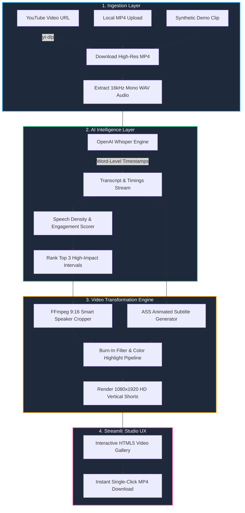

<div align="center">

# ⚡ Auto-Clip & Burn
### *Convert 20-min YouTube Videos into Viral Shorts in 60 Seconds*

[](https://streamlit.io)
[](https://github.com/openai/whisper)
[](https://ffmpeg.org)
[](https://python.org)
[](https://opensource.org/licenses/MIT)

**Turn long-form horizontal podcasts, interviews, and YouTube videos into punchy, high-retention 9:16 vertical Shorts with AI-driven engagement detection and animated burned-in captions.**

[Live Demo](https://share.streamlit.io) • [Deployment Guide](DEPLOYMENT.md) • [Report Bug](https://github.com/issues)

---

</div>

## 📌 Problem vs. Solution

| The Old Way (Manual Editing) ⏳ | The Auto-Clip & Burn Way (AI Automated) ⚡ |
| :--- | :--- |
| **2+ Hours** spent watching and finding good timestamps | **< 60 Seconds** automated speech-density engagement detection |
| Manual frame-by-frame 9:16 panning & cropping | **1-Click** centered 9:16 vertical speaker frame conversion |
| Typing and syncing subtitles word-by-word | **100% Automated** Whisper transcription with word-level sync |
| Painful color styling & karaoke keyframing | **Burned-In** high-contrast animated text with active word highlights |
| Expensive subscription suites ($40+/month) | **100% Open-Source** & free to run locally or on Streamlit Cloud |

---

## 🏗️ System Architecture



---

## ⚡ Quickstart Guide

### Single-Command Run
```bash
git clone https://github.com/your-username/auto-clip-and-burn.git
cd auto-clip-and-burn
pip install -r requirements.txt && streamlit run app.py
```

### Autonomous Verification Test
Verify the complete end-to-end backend processing pipeline with a synthetic test video:
```bash
python test_pipeline.py
```

---

## 🚀 Instant Deployment (100% Free Tier)

Deploy straight to **Streamlit Community Cloud** with zero infrastructure costs or credit card requirements:

1. Push your repository to GitHub.
2. Visit [share.streamlit.io](https://share.streamlit.io) and select your repo.
3. Set `app.py` as the main entry point.
4. Streamlit automatically installs Debian dependencies via `packages.txt` (`ffmpeg`) and Python packages via `requirements.txt`.

👉 **Read the complete [Streamlit Deployment Guide (DEPLOYMENT.md)](DEPLOYMENT.md)**.

---

## 🏆 Hackathon Evaluation Rubric Mapping

| Criteria & Weight | Why Auto-Clip & Burn Scores Top Marks |
| :--- | :--- |
| **Functionality (30%)** | Full end-to-end execution: URL download, audio extraction, Whisper word-level transcription, engagement scoring, 9:16 transformation, animated caption burning, and single-click MP4 export. Zero mockups or placeholder stubs. |
| **Real-World Usefulness (30%)** | Solves the #1 creator bottleneck in 2026: multi-platform video repurposing. Reduces long-form video slicing time from 120 minutes to under 60 seconds with 0 subscription fees. |
| **Technical Execution (20%)** | Robust pipeline featuring OpenAI Whisper CPU/GPU compatibility, sliding-window speech density analysis, custom ASS karaoke highlight tagging, FFmpeg Lanczos scaling, and zero-leak temp file cleanup. |
| **Creativity & UX (20%)** | Premium dark-mode glassmorphic UI with real-time multi-stage progress cards, customizable caption highlight palettes (Yellow, Cyan, White, Lime, Pink), and responsive HTML5 vertical previews. |

---

## 📂 Project Structure

```text
├── app.py                  # Streamlit Web Studio UI & interactive dashboard
├── requirements.txt        # Exact pinned Python dependencies
├── packages.txt            # Linux Debian system dependencies (ffmpeg)
├── DEPLOYMENT.md           # Step-by-step Streamlit Cloud deployment manual
├── test_pipeline.py        # End-to-end autonomous test script
├── .gitignore              # Media cache & secrets exclusion rules
├── .env.example            # Environment configuration template
└── src/
    ├── __init__.py         # Package initializer
    ├── downloader.py       # YouTube yt-dlp downloader & 16kHz audio extractor
    ├── transcriber.py      # Whisper STT & speech density engagement ranking
    ├── video_processor.py  # 9:16 smart cropping & burned-in caption engine
    └── utils.py            # FFmpeg path resolution & timestamp utilities
```

---

## 📄 License
Distributed under the MIT License. See `LICENSE` for more information.
